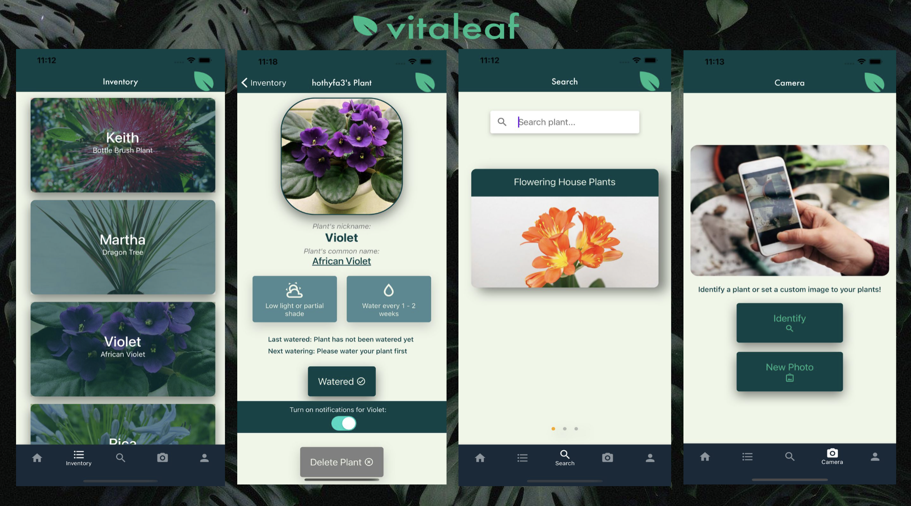

# Plant-Manager-App-FE

Welcome to VitaLeaf's Front-End repository which was the end of course project at Northcoders bootcamp.
Im an avid plant enthusiast and wanted to create a mobile application which could aid in plant maintenance,
collection, monitoring and care for the user's plants.

React native, Expo and Typescript have been implemented primarily for the Front-End development of our app.

The app allows users to sign up, login, add plants to their collection, users are also able to look up new plants, take a photo of a plant using the devices camera or from camera roll. This can then be used to add to the users single plant in their collection or using plant.id api for photo recognition and what species the plant is.
The Back-End api, was built mostly on AWS. Using Dynamo DB as database storage to store and tell users all the information about a specific plant, including light/shade needs and watering requirements. The user can then mark a plant as watered and the app will tell them when that plant should next be watered based upon its category and its plant data.

## Back-End

The Back-End was built using the following Amazon Web Services:
API Gateway,
Lambda Functions,
Dynamo DB,
S3 Storage and Cognito.

Link for Back-End: [Back-End Repository](https://github.com/Elbeera/Plant-Manager-App-BE)

## Running the project

Please fork from my repository on Github and clone with the green copy code button to your VS code (or equivalent code viewer application).

To run this project you need to use `npm install` to install the dependencies and then you will need to install expo-go on your mobile device and computer.
Using the command `expo start` will then run the project.

### Installs used in the project:

expo,
react-navigation,
material ui,
tab navigator,
expo image picker,
expo camera,
react-native-camera,
aws-amplify,
aws-amplify-react-native,
@react-native-async-storage/async-storage,
npm install --save @react-native-community/netinfo,
npm i react-native-sensors,
axios.

**Sneak-peek:**

